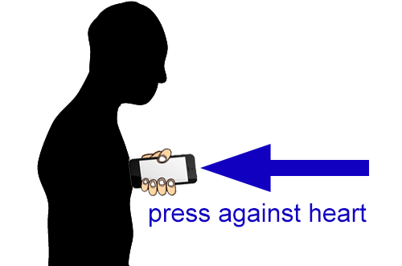

In-browser heart rate estimation on smartphones
=============

Research-grade JavaScript code for estimating users' current heart rate on a smartphone from within the browser, using accelerometer sensors.
Acceleration is obtained using `DeviceMotionEvent', the signal is smoothed using [Savitzky-Golay filtering](https://en.wikipedia.org/wiki/Savitzky%E2%80%93Golay_filter) on two timescales (slow y-movement - breathing and fast y-movement - heart beat), slow breathing movements are subtracted, and peaks are counted in the remaining signal to obtain an approximate beat frequency.

A [live demo](http://tiny.cc/browserbpm) can be found at **tiny.cc/browserbpm**. (note - this will only work on a smartphone and with a browser supporting `DeviceMotionEvent'). Tested on Chrome and Firefox mobile.

Note: this is an unrefined proof of concept and work in progress (accuracy is not verified, parameters are not tuned, speed not optimized, code is not cleaned up etc.). 